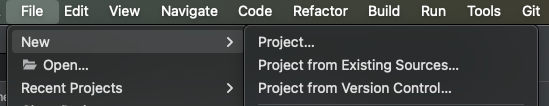
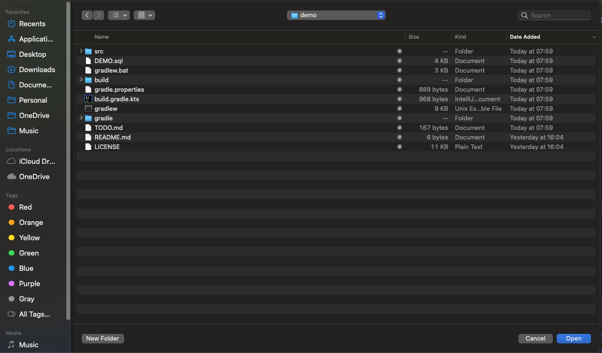
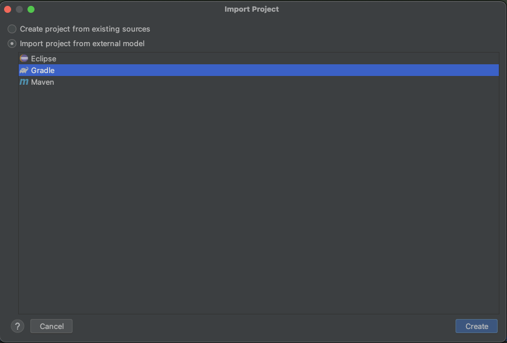
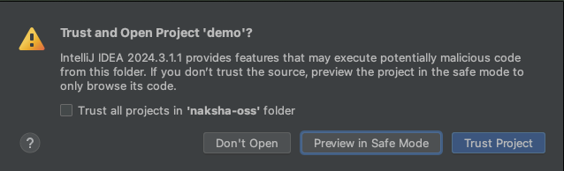
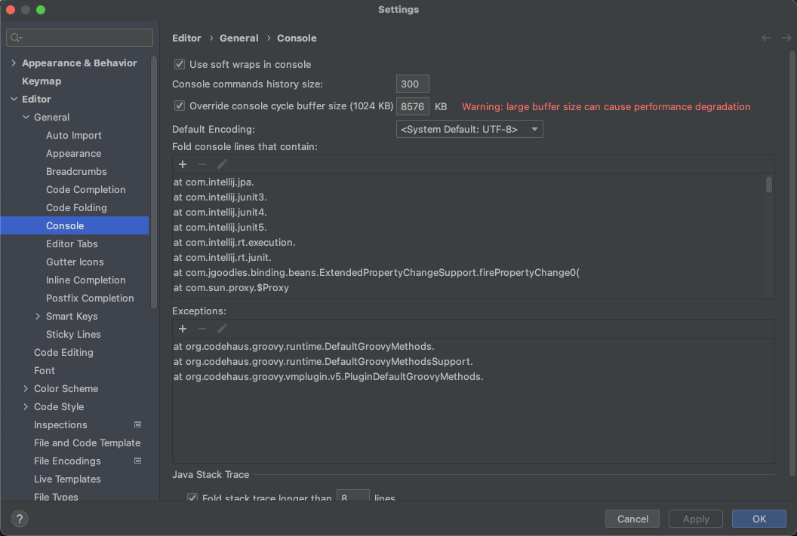

# Naksha Demo
[This demo](https://github.com/naksha-oss/demo) show the usage of Naksha Storage-Abstraction-Layer. It is currently based upon via `lib-psql`, an implementation using [PostgresQL](https://www.postgresql.org/).

## Running the demo
You need to have the following software available and setup:
- [IntelliJ](https://www.jetbrains.com/idea/)
- [gradle](https://gradle.org/)
- [docker](https://www.docker.com/)

It's recommended to have some database client at hand, for example:
- [DBeaver](https://dbeaver.io/download/)

Ones this is the case, you can clone this repository.

### Clone anonymously _(HTTPS)_:
```bash
  mkdir -p ~/naksha-oss || exit 1
mkdir -p ~/naksha-oss/demo || exit 1
cd ~/naksha-oss/demo || exit 1
git clone https://github.com/naksha-oss/demo.git
```

### Clone with personal account _(SSH)_:
```bash
  mkdir -p ~/naksha-oss || exit 1
mkdir -p ~/naksha-oss/demo || exit 1
cd ~/naksha-oss/demo || exit 1
git clone git@github.com:naksha-oss/demo.git
```

### Setup IntelliJ
After checking out, open IntelliJ and import the project using the following steps:






Optionally, increase the console cyclic buffer size to `1048576` KiB:



### Finally
Now you can open this [README](README.md) file in _IntelliJ_ and execute the demo code, like starting your own database and run the demo code.

## Database
To run this demo, first create and start a specific PostgresQL docker container. It is recommended to keep you database locally available, so you can restart it and review the content for debugging purpose:

### Create docker container
Naksha maintains a special PostgresQL database image, that is compatible with what AWS Aurora offers in regard to Naksha `lib-psql` demands. To start such a pseudo Aurora, just use the following command:

```bash
  export IMG=ghcr.io/naksha-oss/naksha-postgres:v16.2-r4
mkdir -p ~/demo
mkdir -p ~/demo/pg_data
mkdir -p ~/demo/pg_temp
docker pull $IMG
docker run --name demo_pg \
       -v ~/demo/pg_data:/usr/local/pgsql/data \
       -v ~/demo/pg_temp:/usr/local/pgsql/temp \
       -p 0.0.0.0:5432:5432 \
       -e PGPASSWORD=demopass \
       -d $IMG
```

This command creates a directory `demo` in you home directory _(`~/demo`)_ in which the database will store the data. So, this means, when you shut down the docker, the data is still available. It allows you to modify the `postgres.conf` file, and restart the database, if you have some own needs.

The database should now be available as:
- host: `localhost`
- port: `5432`
- database: `postgres`
- user: `postgres`
- password: `demopass`
- JDBC: `jdbc:postgresql://localhost:5432/postgres?user=postgres&password=demopass`

### Show running container
```bash
  docker ps
```

### Stop container
```bash
  docker stop demo_pg
```

### Modify Postgres Config
```bash
  cd ~/demo/pg_data
vim postgresql.conf
```

### Start container
```bash
  docker start demo_pg
```

## Example
This is a simple demo, just review the [main](src/main/kotlin/Main.kt) source.

## Links
- [Naksha v3 source code](https://github.com/heremaps/naksha/tree/v3)
- [Naksha Documentation](https://heremaps.github.io/naksha/)
- [Naksha @ Maven Central](https://central.sonatype.com/search?q=naksha-oss)
- [Naksha Docker Containers](https://github.com/naksha-oss?tab=packages)
  - [Naksha PostgresQL Docker](https://github.com/users/naksha-oss/packages/container/package/naksha-postgres)
- [This](https://github.com/naksha-oss/demo)

## Artifacts
Naksha is an open source projects, the artifacts can be found on [Maven Central](https://central.sonatype.com/):

- [lib-base](https://central.sonatype.com/artifact/io.github.naksha-oss/here-naksha-lib-base)
- [lib-diff](https://central.sonatype.com/artifact/io.github.naksha-oss/here-naksha-lib-diff)
- [lib-geo](https://central.sonatype.com/artifact/io.github.naksha-oss/here-naksha-lib-geo)
- [lib-jbon](https://central.sonatype.com/artifact/io.github.naksha-oss/here-naksha-lib-jbon)
- [lib-model](https://central.sonatype.com/artifact/io.github.naksha-oss/here-naksha-lib-model)
- [lib-psql](https://central.sonatype.com/artifact/io.github.naksha-oss/here-naksha-lib-psql)

## Setup your own project
To setup your own project, you need gradle or maven, then follow these instructions:

### Gradle - Configuration
Create a file `gradle/libs.versions.toml`:
```toml
[versions]
naksha = "3.0.0-beta.24"
kotlin = "2.1.20"

[libraries]
naksha_lib_base = { module = "io.github.naksha-oss:here-naksha-lib-base", version.ref = "naksha" }
naksha_lib_diff = { module = "io.github.naksha-oss:here-naksha-lib-diff", version.ref = "naksha" }
naksha_lib_geo = { module = "io.github.naksha-oss:here-naksha-lib-geo", version.ref = "naksha" }
naksha_lib_jbon = { module = "io.github.naksha-oss:here-naksha-lib-jbon", version.ref = "naksha" }
naksha_lib_model = { module = "io.github.naksha-oss:here-naksha-lib-model", version.ref = "naksha" }

# Implementation of lib-model:
naksha_lib_psql = { module = "io.github.naksha-oss:here-naksha-lib-psql", version.ref = "naksha" }

[plugins]

[bundles]
naksha_libs = [
    "naksha_lib_base",
    "naksha_lib_diff",
    "naksha_lib_geo",
    "naksha_lib_jbon",
    "naksha_lib_model",
]
naksha_impl = [
    "naksha_lib_psql"
]
```

Then include from this version config-file:
```kotlin
repositories {
  mavenLocal()
  mavenCentral()
}
dependencies {
    implementation(kotlin("stdlib"))
    implementation(libs.bundles.naksha.libs)
    implementation(libs.bundles.naksha.impl)
    implementation(libs.bundles.logging)
}
```

### Maven - Configuration
```xml
<?xml version="1.0" encoding="UTF-8"?>
<project xmlns="http://maven.apache.org/POM/4.0.0"
         xmlns:xsi="http://www.w3.org/2001/XMLSchema-instance"
         xsi:schemaLocation="http://maven.apache.org/POM/4.0.0 http://maven.apache.org/xsd/maven-4.0.0.xsd">
  <properties>
      <naksha.group>io.github.naksha-oss</naksha.group>
      <naksha.version>3.0.0-beta.24</naksha.version>
  </properties>
  <dependencies>
    <!-- Naksha-API -->
    <dependency>
        <groupId>${naksha.group}</groupId>
        <artifactId>here-naksha-lib-base</artifactId>
        <version>${naksha.version}</version>
    </dependency>
    <dependency>
        <groupId>${naksha.group}</groupId>
        <artifactId>here-naksha-lib-base</artifactId>
        <version>${naksha.version}</version>
    </dependency>
    <dependency>
        <groupId>${naksha.group}</groupId>
        <artifactId>here-naksha-lib-diff</artifactId>
        <version>${naksha.version}</version>
    </dependency>
    <dependency>
        <groupId>${naksha.group}</groupId>
        <artifactId>here-naksha-lib-geo</artifactId>
        <version>${naksha.version}</version>
    </dependency>
    <dependency>
        <groupId>${naksha.group}</groupId>
        <artifactId>here-naksha-lib-jbon</artifactId>
        <version>${naksha.version}</version>
    </dependency>
    <dependency>
        <groupId>${naksha.group}</groupId>
        <artifactId>here-naksha-lib-model</artifactId>
        <version>${naksha.version}</version>
    </dependency>
    <dependency>
        <groupId>${naksha.group}</groupId>
        <artifactId>here-naksha-lib-psql</artifactId>
        <version>${naksha.version}</version>
    </dependency>
  </dependencies>
</project>
```
